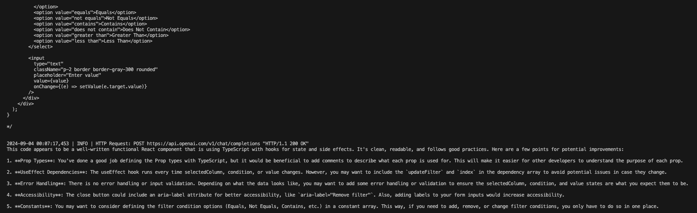
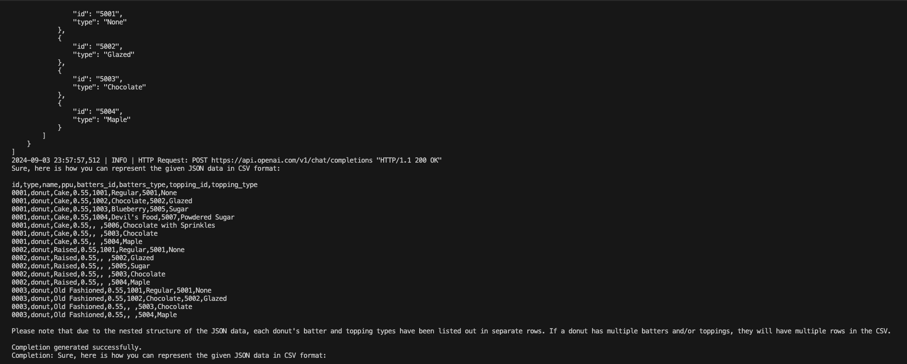
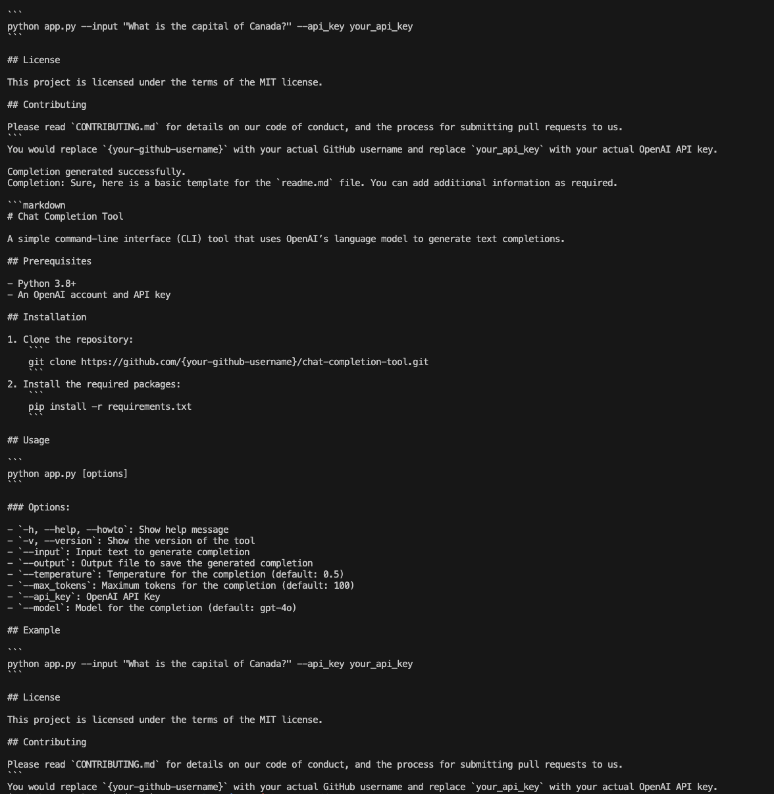
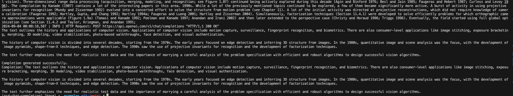

# chat-minal

The chat-minal is a command-line tool work on terminal that makes it easy to interact with the OpenAI Chat Completion API using Langchain. This tool allows you to send text prompts and receive AI-generated responses directly from the command line. You can customize the model, set parameters like temperature and token limits, and save the output to a file. 

> Added new feature 0.1.1 pre defined prompt user can select choice for make genAI running task without input text or prompt.

References [Langchain Document](https://api.python.langchain.com/en/latest/llms/langchain_openai.llms.base.OpenAI.html)

## Demo walkthrough the chatminal

Demo Link [chat-minal tutorial](https://youtu.be/NT175YPU-FY)

## Example of Usage

<center>


*Figure 1: Code Review in Chat Completion Tool*


*Figure 2: Converting JSON to CSV using the Tool*


*Figure 3: Generating Markdown from Text with Ease*


*Figure 4: Summarizing Text in the Chat Completion Tool*

</center>


## Overview

This tool allows you to interact with the ChatOpenAPI from Langchain via a command-line interface (CLI). You can provide input text, specify a model, and configure other parameters to generate chat completions.

Langchain is a Python or Javascript library that provide a flexibility to interact with OpenAI API. It allows you to generate completions for various tasks, such as chat, code, and text generation. You can use Langchain to build AI-powered applications, automate tasks, and enhance your projects with AI capabilities.

- Embedding: Embedding is a process of converting text into a numerical representation. It is a crucial step in natural language processing (NLP) tasks, such as text classification, sentiment analysis, and named entity recognition. Embeddings capture the semantic meaning of words and sentences, enabling machine learning models to understand and process text data.

- Vectorization: Vectorization is a process of converting text data into a numerical representation. It is a fundamental step in natural language processing (NLP) tasks, such as text classification, sentiment analysis, and named entity recognition. Vectorization transforms text data into a format that machine learning models can process and analyze.

- RAG: Retrieval-Augmented Generation (RAG) is a model architecture that combines retrieval and generation to improve the quality of text generation tasks. RAG leverages a retriever to retrieve relevant information from a large corpus of text and a generator to generate responses based on the retrieved information. This approach enables the model to generate more accurate and contextually relevant responses.


## Features

- Easy-to-use CLI for the ChatOpenAI Completion API from Langchain
- Supports various models, temperature settings, and maximum token limits
- Outputs to a specified file or a default file
- Includes error handling and logging
- Streaming Response
- Selecting Models
- Selected Choise for predefiend prompt

## Installation

1. **Clone the Repository:**

   ```bash
   git clone https://github.com/fadingNA/chat-completion-api.git
   cd chat-completion-api
   pip install -r requirements.txt # if you are using pip3 change pip to pip3 instead.

   cd app # to run the play.py file or app/play.py
   ```

## Usage
- locate to examples folder to run the bash script

  ```bash
  python3 play.py ../examples/sample2.json --api_key sk_xxx \
  # using 2 argv[0] and argv[1] for run file and source file
   -i "Tell me about directional derivatives" \ # input text
   --temperature 0.7 \
   --max_tokens 150 \
   --model gpt-4 \ # gpt-4o or gpt-4 
   --output output.txt \
   
  ```

## Options

| Option               | Description                                         |
|----------------------|-----------------------------------------------------|
| `-h, --help, --howto`| Show the help message.                               |
| `-v, --version`      | Show the version of the tool.                        |
| `--input_text, -i`   | Input text to generate completion.                   |
| `--output, -o`       | Output file to save the generated completion.        |
| `--temperature, -t`  | Temperature for the completion.                      |
| `--max_tokens`       | Maximum tokens for the completion.                   |
| `--api_key, -a`      | OpenAI API Key.                                      |
| `--model, -m`        | Model for the completion.                            |
| `--models`           | List all available models on OpenAI.                 |
| `--select_choices`   | Will use a pre defined prompt                        |
| `--token-usage`     | Token usage for the completion.                      |

## Requirements

- Python 3.7+
- An OpenAI API key


## Table of Contributors

| Name          | Blog Post (URL)                  | GitHub Repo (URL)                       | Language    |
|---------------|---------------------------------|-----------------------------------------|-------------|
| Nonthachai Plodthong    | [Blog Post](https://dev.to/fadingna/open-source-development-187j) | [GitHub Repo](https://github.com/fadingNA/chat-completion-api) | Python + SSH |


# License
This project is licensed under the MIT License - see the [LICENSE](https://github.com/fadingNA/chat-completion-api/blob/main/LICENSE) file for details.
